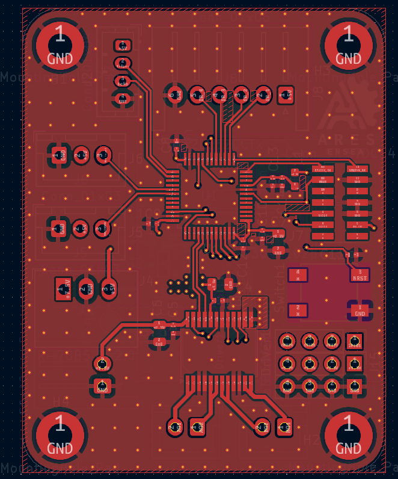
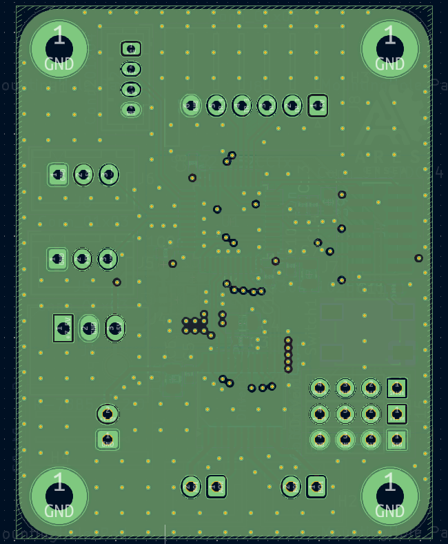
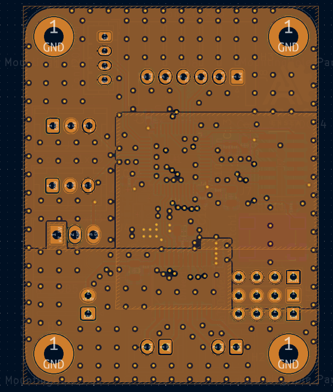
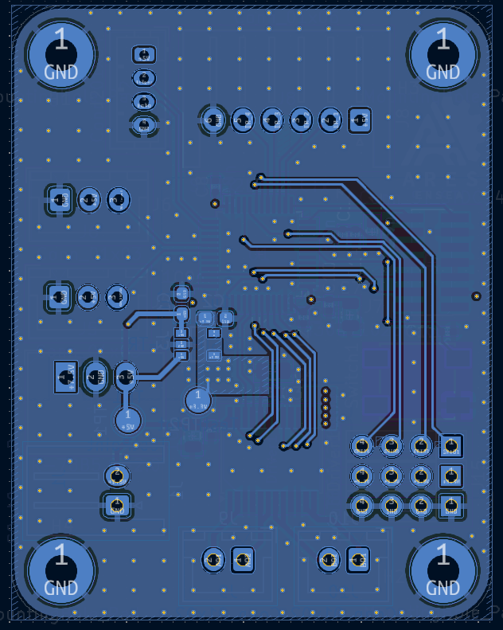

# 🤖 Projet Coupe de France de Robotique 2025 – Design PCB 4 couches

Bienvenue sur le dépôt dédié à mon **design de PCB 4 couches** réalisé dans le cadre de la **Coupe de France de Robotique 2025** organisée par Planète Sciences.  
👉 [Site officiel](https://www.coupederobotique.fr/)

Je participe à cette aventure en tant qu'étudiant de **première année à l'ENSEA**, au sein de l'association **ARES Robotique**, avec une équipe composée également de deuxièmes années.

---

## 🧩 Description du PCB

Ce PCB a été conçu pour les **PAMI** (*Petits Actionneurs Mobiles Indépendants*), et intègre les fonctionnalités suivantes :

- 🧠 **Microcontrôleur :** STM32 L552CCT6
- ⚙️ **Driver moteur :** TB6612FNG
- 🚗 **2 connecteurs pour moteurs DC N20**
- 🔁 **2 connecteurs pour servomoteurs**
- 🧭 **1 connecteur pour module ultrason** (détection et évitement d'obstacles)
- ⚫ **1 connecteur pour module suiveur de ligne infrarouge 4 voies**
- 🔘 **Bouton reset**
- 🔌 **Pins GPIO, 3.3V, GND**
- 🔋 **Connecteur alimentation 7.4V (batterie Ni-Mh)**
- 🔧 **2 régulateurs DC-DC** (5V et 3.3V)
- 🔁 **Bobines, condensateurs, résistances**
- 🛠️ **Connecteur ST-Link** pour programmation et debug

---

## 🎬 Démos en GIF

### 🚗 Suiveur de ligne en action

### 🔩 PCB assemblé avec les composants soudés

---

## 🖼️ Vues des 4 couches du PCB

| Couche | Image |
|--------|-------|
| **Face avant (Front)** |  |
| **Plan de masse (In1)** |  |
| **Plan d'alimentation (In2)** |  |
| **Face arrière (Back)** |  |

---

